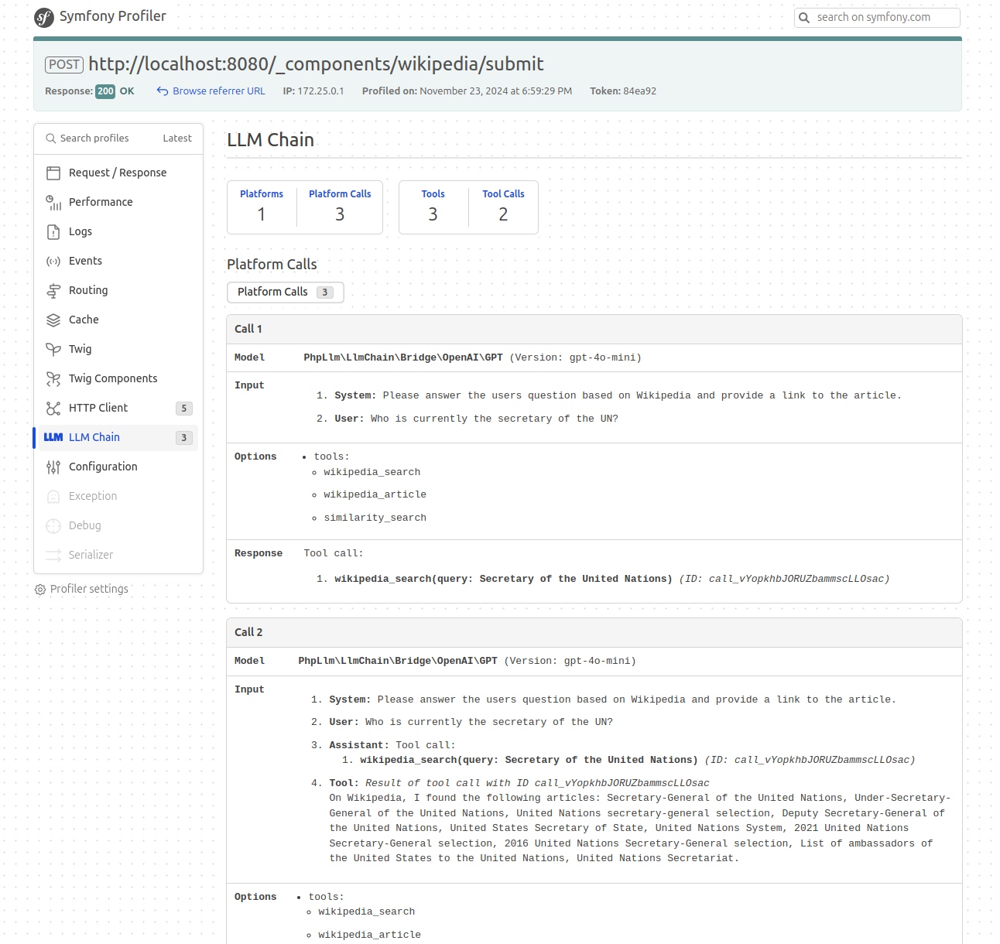

# Symfony AI Bundle

Integration bundle for Symfony AI components.

## Installation

```bash
composer require symfony/ai-bundle
```

## Configuration

### Simple Example with OpenAI

```yaml
# config/packages/ai.yaml
ai:
    platform:
        openai:
            api_key: '%env(OPENAI_API_KEY)%'
    agent:
        default:
            model:
                name: 'GPT'
```

### Advanced Example with Anthropic, Azure, Google and multiple agents
```yaml
# config/packages/ai.yaml
ai:
    platform:
        anthropic:
            api_key: '%env(ANTHROPIC_API_KEY)%'
        azure:
            # multiple deployments possible
            gpt_deployment:
                base_url: '%env(AZURE_OPENAI_BASEURL)%'
                deployment: '%env(AZURE_OPENAI_GPT)%'
                api_key: '%env(AZURE_OPENAI_KEY)%'
                api_version: '%env(AZURE_GPT_VERSION)%'
        google:
            api_key: '%env(GOOGLE_API_KEY)%'
    agent:
        rag:
            platform: 'symfony_ai.platform.azure.gpt_deployment'
            structured_output: false # Disables support for "output_structure" option, default is true
            model:
                name: 'GPT'
                version: 'gpt-4o-mini'
            system_prompt: 'You are a helpful assistant that can answer questions.' # The default system prompt of the agent
            include_tools: true # Include tool definitions at the end of the system prompt
            tools:
                # Referencing a service with #[AsTool] attribute
                - 'Symfony\AI\Agent\Toolbox\Tool\SimilaritySearch'

                # Referencing a service without #[AsTool] attribute
                - service: 'App\Agent\Tool\CompanyName'
                  name: 'company_name'
                  description: 'Provides the name of your company'
                  method: 'foo' # Optional with default value '__invoke'

                # Referencing a agent => agent in agent 🤯
                - service: 'symfony_ai.agent.research'
                  name: 'wikipedia_research'
                  description: 'Can research on Wikipedia'
                  is_agent: true
        research:
            platform: 'symfony_ai.platform.anthropic'
            model:
                name: 'Claude'
            tools: # If undefined, all tools are injected into the agent, use "tools: false" to disable tools.
                - 'Symfony\AI\Agent\Toolbox\Tool\Wikipedia'
            fault_tolerant_toolbox: false # Disables fault tolerant toolbox, default is true
    store:
        # also azure_search, mongodb and pinecone are supported as store type
        chroma_db:
            # multiple collections possible per type
            default:
                collection: 'my_collection'
    embedder:
        default:
            # platform: 'symfony_ai.platform.anthropic'
            # store: 'symfony_ai.store.chroma_db.default'
            model:
                name: 'Embeddings'
                version: 'text-embedding-ada-002'
```

## Usage

### Agent Service

Use the `Agent` service to leverage models and tools:
```php
use Symfony\AI\Agent\AgentInterface;
use Symfony\AI\Platform\Message\Message;
use Symfony\AI\Platform\Message\MessageBag;

final readonly class MyService
{
    public function __construct(
        private AgentInterface $agent,
    ) {
    }

    public function submit(string $message): string
    {
        $messages = new MessageBag(
            Message::forSystem('Speak like a pirate.'),
            Message::ofUser($message),
        );

        return $this->agent->call($messages);
    }
}
```

### Register Tools

To use existing tools, you can register them as a service:
```yaml
services:
    _defaults:
        autowire: true
        autoconfigure: true

    Symfony\AI\Agent\Toolbox\Tool\Clock: ~
    Symfony\AI\Agent\Toolbox\Tool\OpenMeteo: ~
    Symfony\AI\Agent\Toolbox\Tool\SerpApi:
        $apiKey: '%env(SERP_API_KEY)%'
    Symfony\AI\Agent\Toolbox\Tool\SimilaritySearch: ~
    Symfony\AI\Agent\Toolbox\Tool\Tavily:
      $apiKey: '%env(TAVILY_API_KEY)%'
    Symfony\AI\Agent\Toolbox\Tool\Wikipedia: ~
    Symfony\AI\Agent\Toolbox\Tool\YouTubeTranscriber: ~
```

Custom tools can be registered by using the `#[AsTool]` attribute:

```php
use Symfony\AI\Agent\Toolbox\Attribute\AsTool;

#[AsTool('company_name', 'Provides the name of your company')]
final class CompanyName
{
    public function __invoke(): string
    {
        return 'ACME Corp.'
    }
}
```

The agent configuration by default will inject all known tools into the agent.

To disable this behavior, set the `tools` option to `false`:
```yaml
ai:
    agent:
        my_agent:
            tools: false
```

To inject only specific tools, list them in the configuration:
```yaml
ai:
    agent:
        my_agent:
            tools:
                - 'Symfony\AI\Agent\Toolbox\Tool\SimilaritySearch'
```

### Profiler

The profiler panel provides insights into the agent's execution:


